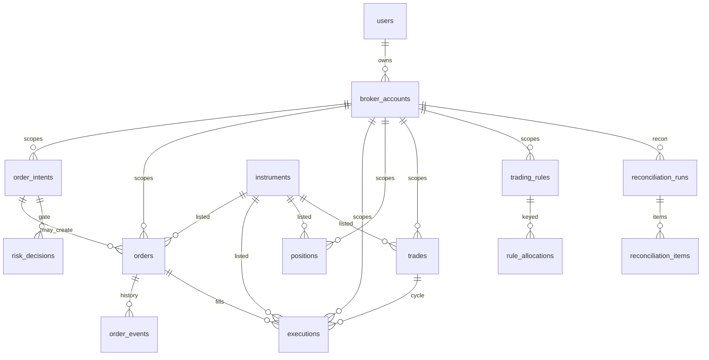

# Database Architecture

AWS RDS MySQL is a **mirror ledger**. It is not the trading source of truth in this stage.

## Source of Truth policy

```text
Trading Core
    ↓
AppState
    ↓
JsonStateRepository  →  data/paper-account.json   (runtime authority)
    ↓ success
RDS Mirror Projector →  auto_trading             (PERSISTENCE_MODE=mirror only)
```

| Store | Role |
| --- | --- |
| Filesystem JSON | Runtime authority while migrating. VTS test artifacts. `strategy-config.json`. |
| AWS RDS MySQL | Permanent trade ledger (orders, executions, trades, snapshots). Mirror only. |
| Redis | Quote cache, universe search, worker lock, pub/sub. **Not** order/fill source of truth. |

`PERSISTENCE_MODE=json` (default): existing program behavior. No DB writes.
`PERSISTENCE_MODE=mirror`: JSON save succeeds, then best-effort DB projection.
`PERSISTENCE_MODE=database` is **not implemented**. Do not promote RDS until mirror is proven.

## Mirror failure safety

Broker / AppState transition completes first. If RDS write fails:

- JSON state remains valid
- `DB_MIRROR_DEGRADED` is recorded
- Broker retry count stays **0**
- DB rollback is not a broker rollback

Never: KIS fill success → DB failure → resubmit order.

## Users and accounts

Membership/JWT is not built. A deterministic **LOCAL_OWNER** bootstrap user is upserted (`BOOTSTRAP_USER_EMAIL`, default `local-owner@localhost`).

`broker_accounts` are scoped by `broker` + `environment` (`MOCK` / `PAPER` / `REAL`). Secrets are **not** stored. Only `credential_ref` such as `env:KIS_PAPER`. PAPER and REAL never share `broker_account_id`.

## Ledger roles

| Table / view | Role |
| --- | --- |
| `order_intents` | Runtime intent mirror. UNIQUE `(broker_account_id, intent_key)` **plus** in-memory idempotency. |
| `orders` | Parent local orders. `local_order_id` and exact KIS `broker_order_no` (ODNO). UNIQUE local + UNIQUE `(account, broker_order_date, broker_order_no)`. |
| `order_events` | Append-only status trace. Does not drive runtime. |
| `executions` | **Actual fill ledger**. UNIQUE `(broker_account_id, execution_key)`. Parent stays in `orders`; filled child orders project to executions. |
| `v_buy_history` | VIEW over `executions WHERE side = 'BUY'`. There is no `buy_history` table. |
| `positions` | **Current** holdings (`code` + `rule_scope`). Not a historical ledger. Position-only legacy rows use `provenance=LEGACY_STATE` and do not invent fills. |
| `trades` | One cycle: flat → buys/sells → flat. Weighted average cost, same as runtime `fills.ts`. OPEN / PARTIALLY_CLOSED / CLOSED. |
| `cash_balance_snapshots` | `cash_balance` and `orderable_amount` are different columns. Overseas PAPER `USD cash=0` / `orderable=100000` is valid. |
| `account_snapshots` | total / cash / stock / PnL when known. Unknown values are omitted, not invented. |
| `fx_rate_snapshots` | Observed FX from KIS. Not an FX conversion product. |
| `reconciliation_runs` / `items` | Record current recon result. DB mirror failure is **not** a recon mismatch. Recon mismatch still blocks new orders in Trading Core. |
| `risk_decisions` | ALLOW / DENY / BLOCK traces. Runtime `checkHardLimits` remains source of truth. |
| `risk_limits` | Policy snapshot only. Not used to relax REAL amount limits. |
| `trading_rules` / `rule_allocations` | Mirror of `strategy-config.json` + AppState allocations. Runtime still reads the JSON file. |
| `auto_conditions` / `dca_plans` | Mirror only. Execution behavior unchanged. |
| `trading_candidates` / `watchlists` / `notifications` / `ai_recommendations` | Foundation / future. AI recommendation product is not implemented. |

Future AI path (not built):

```text
AI Recommendation → Instrument verification → Trading Candidate → Risk → Order Intent
```

## Instruments

`instruments` / `instrument_aliases` / `instrument_sync_runs` exist on RDS. This stage bootstraps the in-app universe (KR seed names + US seed names + codes present in AppState). Full KOSPI/KOSDAQ/NASDAQ/NYSE/AMEX master sync is a later stage.

## Monetary and time types

- Money: `DECIMAL(28,8)` stored as strings in the application. Do not round-trip authoritative amounts through IEEE float then write back.
- Time: `DATETIME(6)` UTC on write. UI display uses `Asia/Seoul` via explicit timezone formatters.

## Transactions

Mirror batch: BEGIN → intent upsert → order upsert → execution insert → position upsert → trade projection → order event append → COMMIT. Failure ROLLBACK. That rollback never unbinds a KIS order.

Trade / position / execution projection uses unique keys and (on MySQL) `SELECT ... FOR UPDATE` on the open trade so the same fill cannot be applied twice.

## History APIs

Read-only, cursor + limit (default 50, max 100):

- `GET /api/history/buys`
- `GET /api/history/trades`
- `GET /api/history/trades/:id`
- `GET /api/db/positions` (current DB snapshot; does not replace runtime positions)
- `GET /api/runtime/database` (no credentials / full endpoints)

Empty when `PERSISTENCE_MODE=json`.

## Legacy import

`npm run db:import-legacy` requires `CONFIRM_LEGACY_IMPORT=YES` and `PERSISTENCE_MODE=mirror`. It records `migration_runs`. JSON is not assumed to be a complete trade history. Positions without fill evidence stay `LEGACY_STATE`.

## ERD (adopted RDS)



## Future DB source-of-truth

Not this stage. Keep JSON authority until:

1. Mirror matches runtime for intents, ODNO, executions, WA PnL, PAPER/REAL isolation
2. Mirror failure never retries broker
3. Recon gate still blocks on KIS mismatch, not on DB errors

Then a later change can introduce `PERSISTENCE_MODE=database` behind tests. Do not delete JSON or enable VTS/REAL orders as part of adoption.
